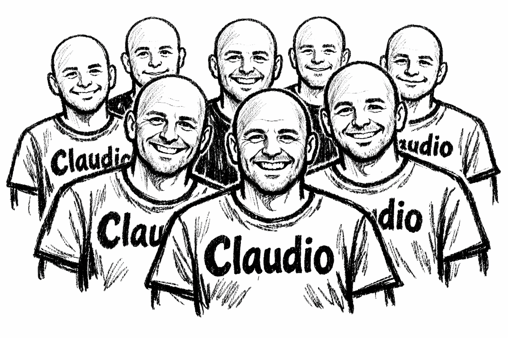

<div align="center">



# ClaudiOS

[](LICENSE)
[](https://github.com/mateolafalce/claudios/stargazers)
[](https://ubuntu.com)
[](https://claude.ai/code)

**What if your entire OS was just Claude?**

A Linux distro that boots straight into [Claude Code](https://claude.ai/code). No desktop. No window manager. Just a TTY and an AI agent with full system access. Built on Ubuntu 24.04 LTS.

[Quick Start](#quick-start) · [How It Works](#how-it-works) · [Features](#features) · [Build From Source](#build-from-source)

</div>

<div align="center">


</div>

---

## Why?

If Claude Code can install packages, write and run code, manage files, browse the internet, and operate your entire machine — what do you need a desktop for?

ClaudiOS takes this idea to its logical conclusion: the operating system gets out of the way and Claude becomes the interface. You boot, you log in, and you're talking to Claude. That's it.

Flash it to a USB stick, boot any x86_64 machine, and you have a portable AI workstation.

## Quick Start

### 1. Build the ISO

```bash
sudo apt install live-build curl gnupg
sudo ./build.sh
```

### 2. Flash to USB

```bash
sudo dd if=live-image-amd64.hybrid.iso of=/dev/sdX bs=4M status=progress
```

Replace `/dev/sdX` with your USB device (`lsblk` to find it).

### 3. Boot and go

Log in with `claudios` / `claudios` and you're in Claude Code.

## How It Works

```
BIOS/UEFI → GRUB → Linux → TTY login
  └─ user: claudios / password: claudios
       └─ claudios-shell (login shell)
            ├─ [if claude missing] auto-install via npm
            └─ Claude Code in loop
                 └─ Ctrl+C (3s) → escape to bash
```

`claudios-shell` is the user's actual login shell — set in `/etc/passwd`, not a `.bashrc` hack. It launches Claude Code in a loop. If Claude exits, you're prompted to restart or drop to bash.

## Features

- **Zero-config boot** — log in and you're in Claude Code, ready to work
- **USB persistence** — first boot auto-creates a persistence partition; your auth, config, and session history survive reboots
- **Escape hatch** — hold Ctrl+C for 3 seconds at startup to drop to a standard bash shell
- **Auto-install** — if `claude` isn't found in PATH, it's installed automatically via npm
- **Built-in slash commands** — `/reboot` reboots the system, `/shut-down` exits back to the shell
- **Passwordless sudo** — for system operations Claude needs (reboot, package install)
- **~1 GB ISO** — boots in under a minute on most hardware

## Test in QEMU

No need to flash a USB to try it:

```bash
sudo apt install qemu-system-x86
./test.sh
```

Already flashed a USB? You can boot it in QEMU too:

```bash
sudo apt install ovmf
sudo qemu-system-x86_64 \
  -drive file=/dev/sdX,format=raw \
  -drive if=pflash,format=raw,readonly=on,file=/usr/share/OVMF/OVMF_CODE_4M.fd \
  -drive if=pflash,format=raw,file=/usr/share/OVMF/OVMF_VARS_4M.fd \
  -m 4G \
  -enable-kvm \
  -cpu host
```

Replace `/dev/sdX` with your USB device (`lsblk` to find it). OVMF is required because the ISO uses UEFI boot via GRUB2.

## Build From Source

### Requirements

- Linux system with `live-build`
- `curl` and `gnupg`
- Internet connection
- ~10 GB free disk space

### Build pipeline

1. `auto/config` — passes flags to `lb config` (Ubuntu Noble, amd64, GRUB bootloader)
2. `config/package-lists/claudios.list.chroot` — packages installed in the image
3. `config/hooks/live/*.hook.chroot` — chroot scripts (locale, Node.js, Claude Code, user creation)
4. `config/includes.chroot/` — files copied verbatim into the filesystem

### Clean build artifacts

```bash
sudo ./clean.sh
```

## Project Structure

```
claudios/
├── build.sh                    # Main build script (requires sudo)
├── clean.sh                    # Removes build artifacts
├── test.sh                     # Launches the ISO in QEMU
├── auto/
│   ├── config                  # live-build configuration
│   ├── build                   # Wrapper for lb build
│   └── clean                   # Wrapper for lb clean
└── config/
    ├── archives/               # Additional apt repositories (NodeSource)
    ├── package-lists/          # Packages to install in the ISO
    ├── hooks/live/             # Scripts that run inside the build chroot
    │   ├── 0050-locale-timezone.hook.chroot
    │   ├── 0100-install-nodejs.hook.chroot
    │   ├── 0200-install-claude-code.hook.chroot
    │   ├── 0300-create-user.hook.chroot
    │   └── 0350-enable-persist.hook.chroot
    └── includes.chroot/        # Files copied directly into the filesystem
        ├── etc/motd
        ├── etc/shells
        ├── etc/sudoers.d/claudios
        ├── etc/systemd/system/
        │   └── claudios-persist.service
        ├── home/claudios/.claude/commands/
        │   ├── reboot.md            # /reboot slash command
        │   └── shut-down.md        # /shut-down slash command
        └── usr/local/bin/
            ├── claudios-shell      # Primary login shell
            └── claudios-persist    # Auto-persistence setup script
```

## Emergency Recovery

If `claudios-shell` fails and you lose access:

1. **From GRUB**: edit the kernel line and append `init=/bin/bash`
2. **From TTY**: the `claudios` user has sudo — use `chsh` to change the shell

## Default Credentials

| Field    | Value                |
|----------|----------------------|
| Username | `claudios`           |
| Password | `claudios`           |
| API key  | managed by Claude Code |

## License

[MIT](LICENSE)
